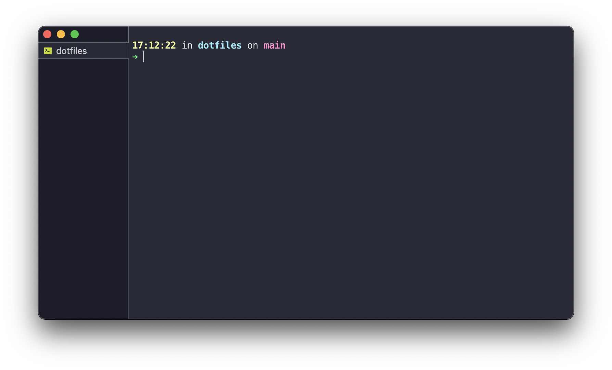

# dotfiles

I've built up a lot of custom [dotfiles](https://missing.csail.mit.edu/2019/dotfiles/) over the years.

This repo is an attempt to capture all of that config, and make it quickly transferrable to new/secondary machines. It would be a shame to lose all of that work if I lost access the files themselves, and there's a lot to be gained by making it easier to install fresh.

I'm also hopeful about using github codespaces in the future, so getting ahead of the game.

## Using this repo

To configure a nice terminal environment (iterm2, zsh, and starship) on a fresh machine, run

```sh
sudo sh ./install.sh
```

That should give you something like this:



Next, take a look at the [checklist](./docs/checklist.md) for the rest.
